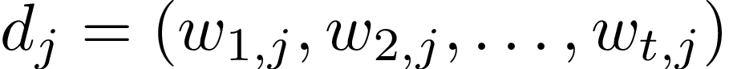
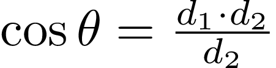

<!-- TODO: look at http://www.mmds.org/#ver21 
     Great summary of similarity and clustering algorithms -->

# Tutorial: Text Similarity and Clustering 

There are many situations in which we would like to measure the
likeness of meaning – or *semantic* similarity – of text. A few examples are:

* *Gaining corpus overview*: Given a new collection of documents, one is often interested
  in getting an overview of what types of documents are contained in the collection. Clustering
  similar documents can give us such an overview.
* *Finding examples for extractor development*: Developing extractors
  typically requires finding examples to inform new rules for distant supervision or
  features. Showing sentences without extractions but which are similar to
  those with extractions helps us find recall errors and improve extractors.
* *Enhancing extraction with latent types as features*: Type information can
  dramatically improve the quality of an extractor, but typical entity type taggers
  recognize only a handful of types. We can add latent type information by clustering 
  words or phrases (with context they appear in), and adding features that indicate
  cluster membership.
* *Linking entities with an incomplete database*: For many entity linking tasks 
  we only have partial databases. For example, there is no database that contains all 
  persons or organizations in the world. In such cases it may be useful to
  collect all information about the unknown entities by clustering their mentions,
  and add them to the database.

While these are all examples where we are interested in *semantic* similarity of text, 
it is worth noting that there also exists a notion of *syntactic* similarity. Syntactic
similarity, which is often used for identifying near-duplicate documents and plagariasm, 
is not covered in this tutorial.

In this tutorial, we show how to estimate the semantic similarity of
two documents, using the Vector Space Model, TF/IDF, and Latent Semantic Analysis.
We further show how to find the nearest neighbor to any given document, and how
to cluster a set of documents.

We use the [Reuters-21578 dataset](http://archive.ics.uci.edu/ml/machine-learning-databases/reuters21578-mld/reuters21578.html),
which contains 20,000 articles that appeared on the Reuters newswire in 1987.
These articles cover a wide variety of topics, including political events,
natural desasters, and business news. 

This tutorial assumes that you are already familiar with setting up and running deepdive applications.

## Installing MADlib

Several of the steps in this tutorial require [MADlib](http://madlib.net/), an extension to Postgres and Greenplum
that offers a library of machine learning algorithms. Please follow the instructions in the [installation guide](https://github.com/madlib/madlib/wiki/Installation-Guide)
to set up MADlib on your machine. See the end of this tutorial for some more notes on setting up MADlib on MacOS. 

After you have installed MADlib, create a database for this project and load
MADlib into this database. These steps can be done by running:

   script/create-db-with-madlib.sh


## Preparing the Reuters dataset

We download the Reuters corpus from [UC Irvine repository](http://archive.ics.uci.edu/ml/machine-learning-databases/reuters21578-mld/reuters21578.html).
The original data is in SGML which we convert to JSON for readability and CSV for loading into the database. The following scripts perform these steps:

    script/fetch-reuters.py
    script/get-reuters-json-csv.py

Next, we create a schema for articles in the database and load the data. Both can be done by running:

    script/load-reuters.py

The articles are stored as strings of text. To more easily design features for document similarity we would like to compute
token boundaries by running a tokenizer. Deepdive offers the
`nlp_extractor` for that. We can run the `nlp_extractor` on the command line or as an extraction
step in our deepdive application. We opt for the latter and add the following extractor to `application.conf`:

```
extract_preprocess: {
  style: json_extractor
  before: psql -h ${PGHOST} -p ${PGPORT} -d ${DBNAME} -f ${APP_HOME}/schemas/sentences.sql
  input: """
         SELECT id,
           body
         FROM articles
         WHERE NOT BODY IS NULL
         ORDER BY id ASC
         """
  output_relation: sentences
  udf: ${DEEPDIVE_HOME}/examples/nlp_extractor/run.sh -k id -v body -l 100 -a "tokenize,ssplit,pos"
}
```

Note: We set `nlp_extractor` to only run its tokenize, ssplit, and pos annotators. We do not run the
parse annotator (which would normally be included), since we don't need parses and parsing requires
many hours of computation time on this corpus.

The output is now by sentence. To simplify working with the data in the following sections, we group
tokens by document:

```
extract_document_tokens: {
  style: sql_extractor
  sql: """DROP TABLE IF EXISTS article_tokens;
          CREATE TABLE article_tokens (id int, words text[]);
          CREATE AGGREGATE array_accum (anyarray)
          (
            sfunc = array_cat,
            stype = anyarray,
            initcond = '{}'
          ); 
          INSERT INTO article_tokens
            SELECT cast(substring(sentence_id from '^[^@]+') as int), 
                   array_accum(words) 
            FROM sentences GROUP BY substring(sentence_id from '^[^@]+');
       """
}
```

We now have table `article_tokens`:

```
  5094 | {The,company,said,the,agreement,is,subject,to,regulatory,approval,.,It,said,...}
 13088 | {Seaway,Multi-Corp,Ltd,said,Peat,Marwick,Ltd,was,appointed,receiver-manager,...}
  4240 | {Qtly,div,34,cts,vs,34,cts,prior,Pay,May,15,Record,April,24,Reuter}
  7498 | {Qtly,cash,distribution,72,cts,vs,72,cts,prior,Pay,May,15,Record,March,31,Reuter}
  3261 | {``,I,think,someone,else,will,probably,come,in,",",or,they,-LRB-,MTS,-RRB-,...}
 14441 | {Reuter,``,As,a,result,of,today,'s,PSC,decision,to,allow,our,private,line,...}
 ...
```

<link rel="stylesheet" href="//cdnjs.cloudflare.com/ajax/libs/KaTeX/0.2.0/katex.min.css">
<script src="//cdnjs.cloudflare.com/ajax/libs/KaTeX/0.2.0/katex.min.js"></script>

## Text Similarity

There are a variety of techniques to estimate the semantic similarity of text documents.
We use the term 'document', but note that a document here can also be a paragraph, a
sentence, or any other range of text. 

Some of the most popular approaches represent each document as a vector of weights. For
example, there 

Perhaps the simplest approach is to represent a document by the set of words that it
contains. 

<div id="element"></div>
<script>
element = document.getElementById('element');
katex.render("c = \\pm\\sqrt{a^2 + b^2}", element);
</script>

<style>
img {
  -webkit-transform: scale(0.5); /* Saf3.1+, Chrome */
     -moz-transform: scale(0.5); /* FF3.5+ */
      -ms-transform: scale(0.5); /* IE9 */
       -o-transform: scale(0.5); /* Opera 10.5+ */
          transform: scale(0.5);
             /* IE6–IE9 */
             filter: progid:DXImageTransform.Microsoft.Matrix(M11=0.9999619230641713, M12=-0.008726535498373935, M21=0.008726535498373935, M22=0.9999619230641713,SizingMethod='auto expand');
}
</style>







The most popular approach is 
To estimate the semantic similarity of documents, one often chooses a representation
of documents and then defines a measure of similarity between documents with this representation.

The most popular approach represents documents as vectors, where each dimension corresponds to
a term contained in the document.


Our goal is to estimate 
Plan: represent each document as a vector of features.
compare documents by comparing their vectors.
Features: bag of words
experiment with phrases (?)


Most entries 0 --> sparse vector representation.

Need encoding of documents as sparse vectors,
as input to madlib

Need features table containing one row for each unique token:

```sql
CREATE TABLE documents_table AS 
  SELECT id, unnest(words) AS term, count(*) AS count FROM article_tokens GROUP BY id, term;
```


```sql
DROP SEQUENCE IF EXISTS dictionary_id_seq;
CREATE SEQUENCE dictionary_id_seq MINVALUE 0 START 0;

DROP TABLE IF EXISTS dictionary_table;
CREATE TABLE dictionary_table AS SELECT nextval('dictionary_id_seq') AS id, a AS term 
  FROM (SELECT DISTINCT unnest(words) AS a FROM article_tokens ORDER BY a) t;
```


And table `features`:

```
 court-ordered
 64,652
 model
 ABABA
 480,200
 desposit
 ...
```

Generate sparse vectors:


SELECT * FROM madlib.gen_doc_svecs('svec_output', 'dictionary_table', 'id', 'term',
                            'documents_table', 'id', 'term', 'count');


geo=# select * from svec_output limit 1;
```
 doc_id |                              sparse_vector
--------+---------------------------------------------------------------------------
      1 | {18,1,12,1,49,1,242,1,1558,1,...,71,1,4}:{0,2,0,20,0,20,0,1,0,1,...,0,1,0}
(1 row)
```


For more information on how to encode sparse vectors and compute cosine distance with MADlib, see [this documentation page](http://doc.madlib.net/latest/group__grp__svec.html).


```sql
SELECT docnum,
                180. * ( ACOS( madlib.svec_dmin( 1., madlib.svec_dot(tf_idf, testdoc)
                    / (madlib.svec_l2norm(tf_idf)*madlib.svec_l2norm(testdoc))))/3.141592654) angular_distance
         FROM svec_output,(SELECT tf_idf testdoc FROM svec_output WHERE docnum = 5) foo
         ORDER BY angular_distance ASC LIMIT 10;
```


stopwords?
Note: on larger copora ... remove stop words for perfornance


TF/IDF

Problem:

example why we want to weight features differently.


tfidf

{#Times in document} * log {#Documents / #Documents the term appears in}.


CREATE TABLE weights AS
          (SELECT doc_id docnum, madlib.svec_mult(sparse_vector, logidf) tf_idf
           FROM (SELECT madlib.svec_log(madlib.svec_div(count(sparse_vector)::madlib.svec,madlib.svec_count_nonzero(sparse_vector))) logidf
                FROM svec_output) foo, svec_output ORDER BY docnum);
SELECT * FROM weights;


Cosine distance 


To see that this works, let's find the documents that are most similar to document 5:

```sql
SELECT docnum,
                180. * ( ACOS( madlib.svec_dmin( 1., madlib.svec_dot(tf_idf, testdoc)
                    / (madlib.svec_l2norm(tf_idf)*madlib.svec_l2norm(testdoc))))/3.141592654) angular_distance
         FROM weights,(SELECT tf_idf testdoc FROM weights WHERE docnum = 5) foo
         ORDER BY angular_distance ASC LIMIT 10;
```

```
 docnum | angular_distance
--------+------------------
      5 |                0
  13799 |  11.019251884022
  15952 | 13.3873511332859
  14486 |   13.46229603937
  13856 | 71.6346392465557
     97 | 77.6169952221422
  14675 | 78.1990826178091
  13394 |  79.989504110232
  13413 | 80.4020417911525
  13758 |  80.506657232129
(10 rows)
```

Clearly, 5 is most similar to itself; the next most similar is document 13799. We verify

```sql
SELECT id, body FROM articles WHERE id in (5, 13799);
```

The two articles are indeed similar, but not identical:

```
  id   |                              body
-------+----------------------------------------------------------------
     5 | The U.S. Agriculture Department                               +
       | reported the farmer-owned reserve national five-day average   +
       | price through February 25 as follows (Dlrs/Bu-Sorghum Cwt) -  +
       |          Natl   Loan           Release   Call                 +
       |          Avge   Rate-X  Level    Price  Price                 +
       |  Wheat   2.55   2.40       IV     4.65     --                 +
...
 13799 | The U.S. Agriculture Department                               +
       | reported the farmer-owned reserve national five-day average   +
       | price through April 6 as follows (Dlrs/Bu-Sorghum Cwt) -      +
       |          Natl   Loan           Release   Call                 +
       |          Avge   Rate-X  Level    Price  Price                 +
       |  Wheat   2.64   2.40       IV     4.65     --                 +
...
```

Now, rerun cosine distance, look at a few examples, eg. document most similar to X

In general good results, and many stop here.


## Latent Semantic Analysis

Problem: synonymy and polysemy

Two snippets of text may be semantically similar, yet have low cosine simi.
Problem especially serious for short text snippets.
Example:

The president ...
Obama ...

solution: map into latent concepts, lower dimensional subspace


SVD

create term-document matrix (sparse)


DROP TABLE IF EXISTS tdm;
CREATE TABLE tdm AS
SELECT docnum as doc, term, value FROM weights, LATERAL unnest(
   madlib.svec_nonbase_positions(tf_idf, 0),
   madlib.svec_nonbase_values(tf_idf, 0)) AS t(term, value);


DROP TABLE IF EXISTS svd_u;
DROP TABLE IF EXISTS svd_v; 
DROP TABLE IF EXISTS svd_s; 

SELECT madlib.svd_sparse('tdm', 'svd', 'term', 'doc', 'value', 
    77993, 19043, 3, 12);

-- k=3, nIterations = 12
select madlib.svd_sparse('inputable', 'svd', 'row_id', 'col_id',
'value', 10000, 10000, 3, 12);
row_dim, col_dim


For more details on computing a singular value decomposition with MADlib, see [this documentation page](http://doc.madlib.net/latest/group__grp__svd.html).

## Clustering

21,578 x 21,578
feasible, but
465,610,084

Larger document collections

rather than find the closest pair across entire collection, find closest pair in random subset (as large as you can handle).
sample as many

## MADlib on MacOS

We recommend building MADlib from source. Checkout the latest version:

```
git clone https://github.com/madlib/madlib.git
```

You will have to install the GNU C++ compiler, as the Clang compiler that ships with MacOS/xcode doesn't
work for this project. We recommend using [MacPorts](https://guide.macports.org/), since it allows one to
easily switch between different compilers.

```
sudo port install g++-4.9
sudo port install gcc_select
```

You can now check which compilers are installed and then select the GNU compiler by running

```
sudo port select --list gcc
sudo port select --set gcc gcc49
```

Now, make sure that running `g++ --version` doesn't return `Apple LLVM version ...`, but `g++ (MacPorts gcc49 ...) ...`.

Now follow the [instructions on building MADlib from source](https://github.com/madlib/madlib/wiki/Building-MADlib-from-Source).

NOTE: There appears to be a bug in the sparse vector encoding which affects this tutorial. Apply 
[these changes](https://github.com/madlib/madlib/pull/309) before compiling.

